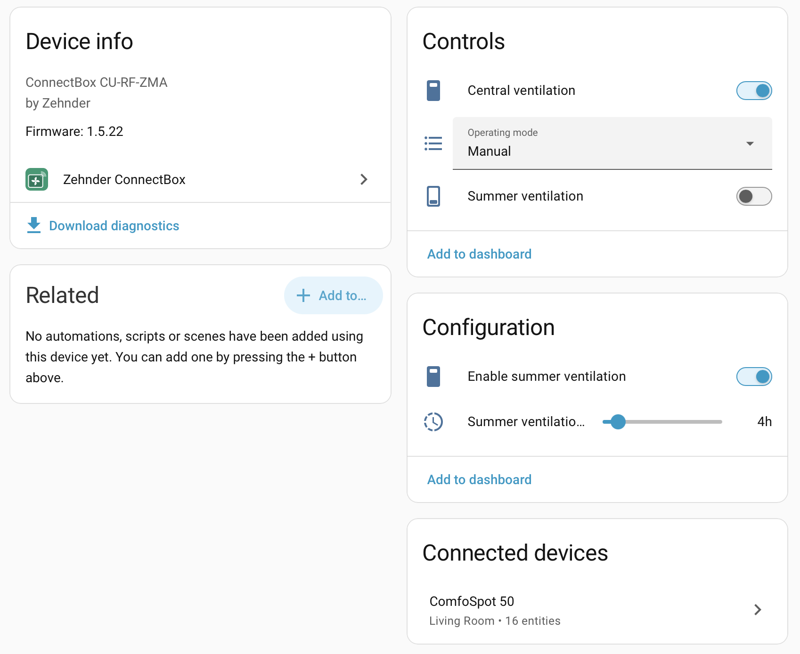
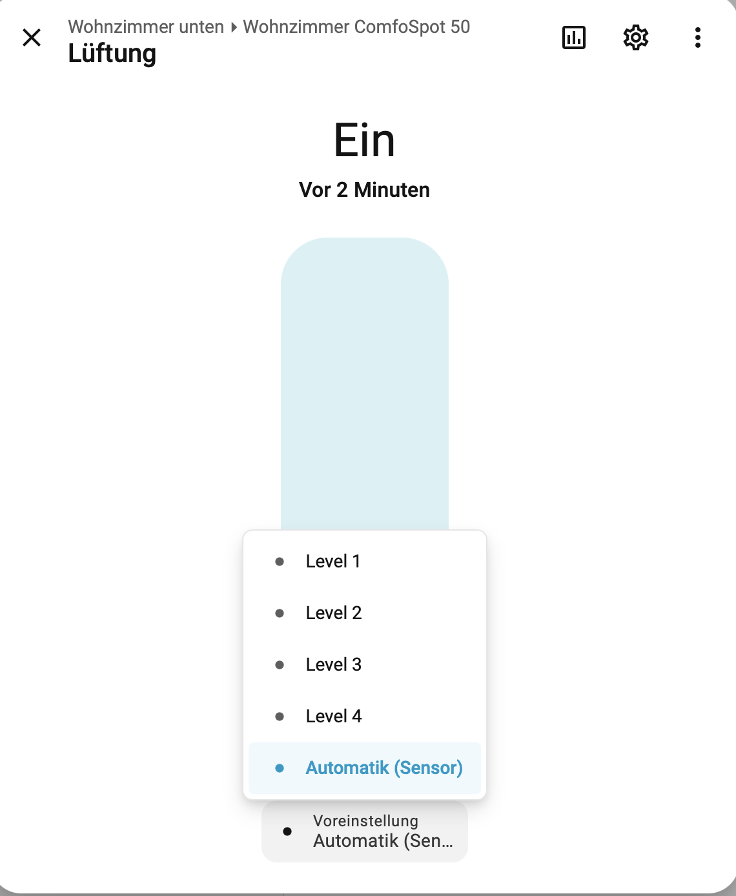
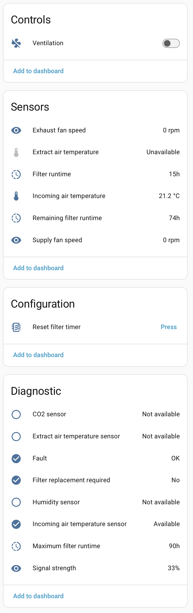

# Zehnder ConnectBox for Home Assistant

Zehnder ConnectBox is an unofficial Home Assistant custom integration for
locally controlling supported ventilation units through a standard Zehnder
ConnectBox gateway.

> [!IMPORTANT]
> **This is a software-only integration.** It communicates directly with the
> existing ConnectBox over the local network. No ESP, replacement control
> board, additional bridge, wiring change, or other hardware modification is
> required.

The integration runs locally and does not contact a Zehnder cloud service or
send telemetry to the project maintainers. It also exposes more technical
information than the official app, including fan speeds, temperatures, filter
counters, radio signal strength, and device diagnostics.



## Support and feedback

If this integration is useful to you, please consider supporting its continued
development through [☕ Buy Me a Coffee](https://buymeacoffee.com/andyblenk).

Suggestions and ideas for improvement are always welcome. Please use
[GitHub Issues](https://github.com/andyblenk/ha-zehnder-connectbox/issues) for
feedback, feature requests, and reproducible problems.

> [!NOTE]
> This is an independent community project. It is not affiliated with,
> endorsed by, sponsored by, or supported by Zehnder Group. Zehnder,
> ConnectBox, ComfoSpot, and ComfoAir are trade marks or product names of their
> respective owners and are used only to describe compatibility.

## Compatibility

This integration is for the **Zehnder ConnectBox CU-RF-ZMA**. It is not for the
separate ComfoConnect LAN C interface used by ComfoAir Q units. Home Assistant
already provides a
[ComfoConnect integration](https://www.home-assistant.io/integrations/comfoconnect/)
for that product family.

| Product | Status |
| --- | --- |
| Zehnder ConnectBox CU-RF-ZMA | Supported gateway |
| Zehnder ComfoSpot 50 | Confirmed on physical hardware |
| Zehnder ComfoAir 70 | Provisional support; physical hardware testing is still needed |
| Other devices connected to a ConnectBox | Detected, but not controlled until their profile is verified |

I do not have access to a ComfoAir 70 and therefore cannot test this profile
myself. If you own one, I would be very grateful for feedback about whether
setup, controls, and entities work as expected. Please open a
[device feedback issue](https://github.com/andyblenk/ha-zehnder-connectbox/issues/new?template=device_feedback.yml)
and attach the sanitized diagnostics generated by the integration.

## What the integration provides

- Automatic local discovery, with manual address entry as a fallback
- Physical pairing with the existing ConnectBox
- One Home Assistant gateway device for each ConnectBox
- Separate Home Assistant devices for supported connected ventilation units
- Automatic detection of supported units linked later in the official app
- Native fan, switch, select, sensor, binary-sensor, and button entities
- Local polling, automatic reconnect, and privacy-preserving diagnostics
- Multiple ConnectBoxes as separate Home Assistant config entries

The integration reads gateway state every 10 seconds, fan speeds, temperatures,
and fault values every minute, and filter counters every 15 minutes. If a
device value is not yet available, it is checked again during the next
scheduled refresh.

The official Zehnder app is still used to commission the system and link
ventilation units to the ConnectBox. It does not need to remain open for this
integration to operate.

## Supported entities

### ConnectBox gateway

| Entity | Home Assistant type | Function |
| --- | --- | --- |
| Central ventilation | Switch | Places the complete connected system in standby or restores the last active mode |
| Operating mode | Select | Automatic, manual, antifreeze, or off |
| Situation | Select | Active situation of the official app; selecting At home or Away switches to the manual mode |
| Summer ventilation | Switch | Starts or stops a summer interval for capable attached units |
| Enable summer ventilation | Switch | Enables or disables the ConnectBox summer function |
| Summer ventilation duration | Number | Sets the duration of future intervals to 1–24 hours |

Summer ventilation is a ConnectBox-wide command, not a separate control on
each ventilation unit. The switch appears when every attached unit has a
validated profile and reports this capability. The function must be enabled
before an interval can be started. Its duration can be changed even while the
function is disabled. Configuration changes are unavailable during an active
interval. The start/stop switch becomes available in automatic or manual mode;
its attributes show the configured duration and reported end time. If the
function is disabled in the official app during an active interval, the
start/stop switch remains available so the running interval can be stopped.

The enable switch and duration number are configuration entities on the
ConnectBox gateway device; the start/stop switch remains a regular control.

While the situation is frost protection or a temporary change, the start/stop
switch is unavailable as well. Whether a unit supplies air, exhausts air, or
both during an interval is set per unit in the official app and shown by its
summer ventilation role sensor.

The ConnectBox firmware version is shown in its Home Assistant device
information when reported by the gateway.

### Supported ventilation unit

| Entity | Home Assistant type | Function |
| --- | --- | --- |
| Ventilation | Fan | Levels 1–4 as 25–100%, named level presets, sensor-controlled Auto where a sensor board is detected, and off where supported |
| Extract air temperature | Sensor | Temperature of air extracted from the room; created when a usable value is reported |
| Incoming air temperature | Sensor | Temperature of incoming outdoor air |
| Humidity | Sensor | Relative humidity measured by the sensor board; only on ComfoSpot 50 units that report it |
| CO2 | Sensor | CO2 concentration measured by the sensor board; only on ComfoSpot 50 units that report it |
| Extract air temperature sensor | Diagnostic binary sensor | Whether the extract-air temperature sensor is available |
| Incoming air temperature sensor | Diagnostic binary sensor | Whether the incoming-air temperature sensor is available |
| Humidity sensor | Diagnostic binary sensor | Whether the humidity sensor is available |
| CO2 sensor | Diagnostic binary sensor | Whether the CO2 sensor is available |
| Exhaust fan speed | Sensor | Exhaust fan speed in rpm |
| Supply fan speed | Sensor | Supply fan speed in rpm |
| Filter runtime | Sensor | Hours elapsed since the last filter reset |
| Remaining filter runtime | Sensor | Hours remaining before filter maintenance is due |
| Maximum filter runtime | Diagnostic sensor | Configured filter maintenance interval |
| Filter replacement required | Diagnostic binary sensor | Indicates that filter maintenance is due |
| Fault | Diagnostic binary sensor | Indicates a currently reported device fault |
| Signal strength | Diagnostic sensor | Radio signal strength between the unit and ConnectBox |
| Level at home, asleep, away, frost protection | Configuration select | Configured level of the unit's room for each situation of the official app |
| Temporary change until | Sensor | End of a temporary change, such as a level changed on the unit's control panel; unknown while none is active |
| Boost until | Sensor | End of a running boost; unknown while none is running |
| Summer ventilation role | Diagnostic sensor | Whether the unit supplies, exhausts, or supplies and exhausts air during the summer ventilation, as set in the official app; created when a ComfoSpot 50 reports it |
| Reset filter timer | Configuration button | Resets the filter counter after filter maintenance; currently verified for ComfoSpot 50 |

The ventilation fan entity provides Home Assistant's standard power and speed
controls. Levels 1–4 can be selected directly as named presets or set as
25–100% fan speed. It shows the level the unit currently runs at, including a
level changed on the unit's own control panel.

Without an optional sensor board, the available presets are Level 1 through
Level 4:


When the unit reports an available humidity or CO2 sensor, the additional
**Auto (sensor)** preset is shown:



Firmware and valid hardware versions are displayed in the ventilation unit's
device information. Optional values are shown only when the connected product
actually reports them.

The four sensor-availability indicators are currently provided for the
physically tested ComfoSpot 50 profile. They show **Available** or **Not
available** when the ConnectBox reports a recognized status. A missing or
unrecognized status leaves the indicator unavailable. A temperature entity is
unavailable when its sensor reports that it is not available.

If an earlier version already created an extract-air temperature entity and it
remains unavailable after updating, remove the stale entity from Home
Assistant's entity registry under **Settings → Devices & services → Entities**.

Firmware updates, installer-only settings, and unverified functions such as
starting a boost are deliberately not exposed. A boost started in the official
app is shown.



See the [screenshot gallery](docs/screenshots.md) for pairing and device views.

### Sensor-controlled operation (Auto)

ComfoSpot 50 units with the optional sensor board (humidity, CO2, or VOC) can
let the unit choose its fan level from its sensors. The ventilation entity
offers this as the `auto` preset only when a sensor board is detected:

- the unit reports an available humidity or CO2 sensor, which only the sensor
  boards provide, or
- the room already uses sensor-controlled operation in one of its situations,
  for example because it was selected in the official app.

Units without a sensor board, units whose sensor status is not yet known, and
the provisional ComfoAir 70 profile do not offer the preset.

The preset selects sensor-controlled operation for the room's currently active
situation, the same choice the official app offers instead of a fixed fan
level. While it is active, the unit chooses its own fan level, so Home
Assistant shows the preset but no percentage. Selecting a level or a
percentage returns the room to a fixed level.

The gateway's **Automatic** operating mode is a separate, system-wide setting
and does not select sensor-controlled operation.

```yaml
# Example: return to sensor control in the morning after a fixed night level
action: fan.set_preset_mode
target:
  entity_id: fan.comfospot_50_ventilation
data:
  preset_mode: auto
```

## Requirements

Before installing this integration:

1. The ventilation unit must have a compatible wireless module installed.
2. A Zehnder ConnectBox CU-RF-ZMA must be connected to the same local network
   as Home Assistant.
3. The official Zehnder Connect app must already be commissioned and working
   locally.
4. The ventilation unit and ConnectBox must already be linked in the app.

No additional controller, adapter, microcontroller, or cloud service is
required.

## Installation with HACS

The repository is not yet part of the default HACS catalogue. Install it as a
custom repository:

1. Open **HACS** in Home Assistant.
2. Open **Integrations**, then the three-dot menu.
3. Select **Custom repositories**.
4. Add `https://github.com/andyblenk/ha-zehnder-connectbox` with category
   **Integration**.
5. Download **Zehnder ConnectBox** and restart Home Assistant.

## Setup

1. Open **Settings -> Devices & services -> Add integration**.
2. Search for **Zehnder ConnectBox**.
3. Wait for the short local discovery scan and select the desired ConnectBox.
4. If discovery cannot cross your network boundary, choose manual setup and
   enter the ConnectBox address.
5. Confirm pairing. Optionally choose the name shown for this instance in the
   ConnectBox's paired applications; the default is **Home Assistant**.
6. Briefly press the access-key button on the ConnectBox while its indicator
   is blinking.

The pairing name is sent only when the integration is first paired. Changing
it for an existing entry requires pairing that instance again.

Home Assistant creates the gateway device and each recognized ventilation
unit behind it. If another supported unit is linked later in the Zehnder app,
it is added during a subsequent refresh. Assign Home Assistant areas normally;
the integration does not create duplicate room entities.

## Filter timer reset

Only use **Reset filter timer** after the filters have actually been cleaned or
replaced. The integration first acknowledges the filter-replacement state,
waits for the ConnectBox to confirm the write, resets the current runtime to
zero, and reads the value back.

Home Assistant button entities cannot require a confirmation dialog on their
device page. To protect this action on a dashboard, use a confirmation action
and replace the example entity ID with your own:

```yaml
type: button
entity: button.comfospot_50_reset_filter_timer
name: Reset filter timer
icon: mdi:air-filter
tap_action:
  action: perform-action
  perform_action: button.press
  target:
    entity_id: button.comfospot_50_reset_filter_timer
  confirmation:
    title: Reset filter timer?
    text: Confirm only after the filters have been cleaned or replaced.
    confirm_text: Reset
    dismiss_text: Cancel
```

Direct presses from the device page, Developer Tools, scripts, or automations
execute the reset without that dashboard confirmation.

## Troubleshooting and diagnostics

- Home Assistant and the ConnectBox must be able to reach each other on the
  local network. Client isolation and VLAN firewall rules can block discovery
  or control.
- If discovery fails but routing is available, use manual setup with the
  ConnectBox IP address.
- The gateway certificate is trusted during deliberate physical pairing and
  pinned for later connections. A certificate change is treated as a security
  error rather than being accepted silently.
- Download diagnostics from the integration entry before opening an issue.
  Diagnostics omit host addresses, names, serial numbers, UUIDs, certificate
  fingerprints, pairing material, and raw protocol frames.

For defects, questions, ideas, and device feedback, use
[GitHub Issues](https://github.com/andyblenk/ha-zehnder-connectbox/issues).
Please review every screenshot and diagnostic attachment for private data.

## Safety and responsibility

Install and operate this integration at your own risk. It is not supported by
the manufacturer. Keep the original controls available and verify correct
ventilation operation after installation and updates. The integration does
not replace required maintenance, safety checks, or filter changes.

## Versioning and releases

Releases follow [Semantic Versioning](https://semver.org/). HACS installs the
version published in a GitHub release. Pre-1.0 releases may still change as
additional hardware feedback is incorporated.

## License and acknowledgements

Copyright 2026 Andreas Blenk and contributors. Licensed under the
[Apache License 2.0](LICENSE).

The integration depends on `tlslite-ng` for a TLS profile scoped to the local
gateway connection. See [third-party notices](THIRD_PARTY_NOTICES.md). No
manufacturer application code, firmware, artwork, or network captures are
included in this repository.

Contributions and constructive feedback are welcome.
